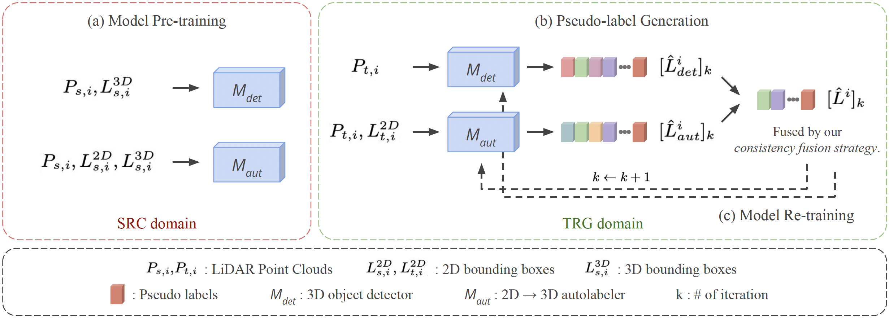

# WLST

Official pytorch implementation of [Tsou et. al, "WLST: Weak Labels Guided Self-training for Weakly-supervised Domain Adaptation on 3D Object Detection", ICRA 2024](https://arxiv.org/abs/2310.03821).

<p align="center"></p>

## Introduction

In this paper, we propose a general weak labels guided self-training framework, WLST, designed for weakly-supervised domain adaptation (WDA) on 3D object detection. By incorporating autolabeler, which can generate 3D pseudo labels from 2D bounding boxes, into the existing self-training pipeline, our method is able to generate more robust and consistent pseudo labels that would benefit the training process on the target domain. Extensive experiments demonstrate the effectiveness, robustness, and detector-agnosticism of our WLST framework. Notably, it outperforms previous state-of-the-art methods on all evaluation tasks.

## Model Zoo

### Waymo -> KITTI Task

|   | Setting | Method | AP_BEV | AP_3D | Download |
|:-:|:-------:|:------:|:------:|:-----:|:--------:|
| PV-RCNN | - | Source Only | 60.32 | 21.66 | - |
| [PV-RCNN](tools/cfgs/da-waymo-kitti_models/pvrcnn_st3d/pvrcnn_st3d.yaml) | UDA | ST3D | 83.37 | 64.75 | - |
| [PV-RCNN](tools/cfgs/da-waymo-kitti_models/pvrcnn_st3d/pvrcnn_st3d.yaml) | WDA |ST3D (w/ SN) | 86.53 | 76.85 | - |
| [PV-RCNN](tools/cfgs/da-waymo-kitti_models/pvrcnn_st3d/wl_labeler_ros_st.yaml) | WDA | WLST | 86.96 | 77.69 | [model](https://drive.google.com/file/d/1SS6WOliSX5eOCd9Cn0gWE6c_cRUsNWCt/view?usp=sharing) |
| PV-RCNN | - | Oracle | 90.85 | 83.00 | - |

<!-- We could not provide the above pretrained models due to [Waymo Dataset License Agreement](https://waymo.com/open/terms/), but you should achieve similar performance by training with the default configs. -->

### Waymo -> nuScenes Task

|   | Setting | Method | AP_BEV | AP_3D | Download |
|:-:|:-------:|:------:|:------:|:-----:|:--------:|
| PV-RCNN | - | Source Only | 34.51 | 21.44 | - |
| [PV-RCNN](tools/cfgs/da-waymo-nus_models/pvrcnn_st3d/pvrcnn_st3d.yaml) | UDA | ST3D | 36.38 | 22.99 | - |
| [PV-RCNN](tools/cfgs/da-waymo-nus_models/pvrcnn_st3d/pvrcnn_st3d.yaml) | WDA |ST3D (w/ SN) | 36.65 | 23.66 | - |
| [PV-RCNN](tools/cfgs/da-waymo-nus_models/pvrcnn_st3d/wl_labeler_ros_st.yaml) | WDA | WLST | 39.54 | 24.46 | [model](https://drive.google.com/file/d/1W0WSYNiGaVbzyALfRIQmsaQ69AL-y5j_/view?usp=sharing) |
| PV-RCNN | - | Oracle | 53.23 | 38.61 | - |

<!-- We could not provide the above pretrained models due to [Waymo Dataset License Agreement](https://waymo.com/open/terms/), but you should achieve similar performance by training with the default configs. -->

### nuScenes -> KITTI Task

|   | Setting | Method | AP_BEV | AP_3D | Download |
|:-:|:-------:|:------:|:------:|:-----:|:--------:|
| PV-RCNN | - | Source Only | 69.26 | 39.17 | - |
| [PV-RCNN](tools/cfgs/da-nuscenes-kitti_models/pvrcnn_st3d/pvrcnn_st3d.yaml) | UDA | ST3D | 77.38 | 70.86 | - |
| [PV-RCNN](tools/cfgs/da-nuscenes-kitti_models/pvrcnn_st3d/pvrcnn_st3d.yaml) | WDA |ST3D (w/ SN) | 83.84 | 72.91 | - |
| [PV-RCNN](tools/cfgs/da-nuscenes-kitti_models/pvrcnn_st3d/wl_labeler_ros_st.yaml) | WDA | WLST | 87.16 | 77.73 | [model](https://drive.google.com/file/d/1A1Tq6idcNwHavl3YEYNLDyTR7v1_J_DP/view?usp=sharing) |
| PV-RCNN | - | Oracle | 90.85 | 83.00 | - |
| SECOND-IoU | - | Source Only | 51.84 | 17.92 | - |
| [SECOND-IoU](tools/cfgs/da-nuscenes-kitti_models/secondiou_st3d/secondiou_st3d.yaml) | UDA | ST3D | 75.94 | 54.13 | - |
| [SECOND-IoU](tools/cfgs/da-nuscenes-kitti_models/secondiou_st3d/secondiou_st3d.yaml) | WDA |ST3D (w/ SN) | 79.02 | 62.55 | - |
| [SECOND-IoU](tools/cfgs/da-nuscenes-kitti_models/secondiou_st3d/wl_labeler_ros_st.yaml) | WDA | WLST | 80.67 | 64.65 | [model](https://drive.google.com/file/d/1UAZduoGPna_xXNqe9Qwd6vIu0Td9ehPi/view?usp=sharing) |
| SECOND-IoU | - | Oracle | 83.29 | 73.45 | - |

## Installation

Please refer to [INSTALL.md](docs/INSTALL.md).

## Getting Started

Please refer to [GETTING_STARTED.md](docs/GETTING_STARTED.md).

## License

Our code is released under the Apache 2.0 license.


## Acknowledgement

Our code is heavily based on [OpenPCDet v0.3](https://github.com/open-mmlab/OpenPCDet/tree/v0.3.0) and [ST3D](https://github.com/CVMI-Lab/ST3D). Thanks OpenPCDet Development Team for their awesome codebase.

## Citation

If you find this project useful in your research, please consider cite:

```
@misc{tsou2023wlst,
    title={WLST: Weak Labels Guided Self-training for Weakly-supervised Domain Adaptation on 3D Object Detection}, 
    author={Tsung-Lin Tsou and Tsung-Han Wu and Winston H. Hsu},
    journal={arXiv preprint arXiv:2310.03821},
    year={2023},
    
}
```

```
@misc{openpcdet2020,
    title={OpenPCDet: An Open-source Toolbox for 3D Object Detection from Point Clouds},
    author={OpenPCDet Development Team},
    howpublished={https://github.com/open-mmlab/OpenPCDet},
    year={2020}
}
```